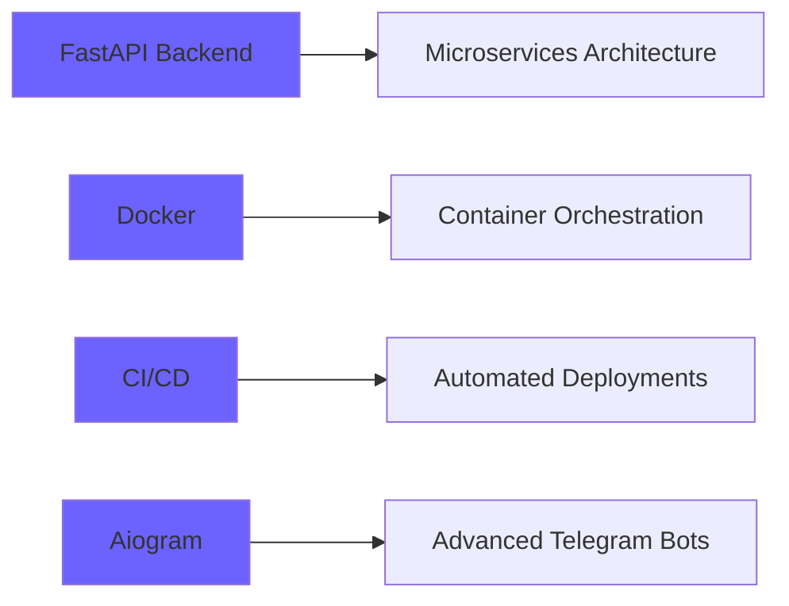

<div align="center">

# 👋 Hey there, I'm Faloon

### Backend Developer | DevOps Enthusiast | Cybersecurity Learner


[](https://t.me/tryb0t)
[](mailto:faloonia@yandex.ru)
[](https://github.com/FaloonAI)

</div>

---

## 🚀 About Me

```python
class Faloon:
    def __init__(self):
        self.username = "FaloonAI"
        self.role = "Backend Developer"
        self.location = "Russia 🇷🇺"
        self.languages = ["Python", "C++", "C", "Bash"]
        self.current_focus = [
            "FastAPI & Microservices",
            "Docker & Containerization", 
            "CI/CD Pipelines",
            "Telegram Bot Development"
        ]
        self.goals_2025 = [
            "Master DevOps practices",
            "Contribute to Open Source",
            "Build production-ready systems"
        ]
    
    def say_hi(self):
        print("Thanks for dropping by! Let's build something awesome together 🚀")

me = Faloon()
me.say_hi()
```

---

## 🛠️ Tech Stack

<div align="center">

### Languages


### Backend & Databases


### DevOps & Tools


### Currently Learning


</div>

---

## 📌 Featured Projects

<div align="center">

<a href="https://github.com/FaloonAI/delivery_opensource">
  
</a>

<a href="https://github.com/FaloonAI/ADBToolkit">
  
</a>

</div>

<br/>

<div align="center">

**🚚 Delivery System** - Open-source delivery management platform with FastAPI  
**📱 ADB Toolkit** - Android automation tools for developers

[📂 View All Repositories →](https://github.com/FaloonAI?tab=repositories)

</div>

---

## 📊 GitHub Statistics

<div align="center">


</div>

<div align="center">


</div>

---

## 🏆 GitHub Achievements

<div align="center">


</div>

---

## 💡 What I'm Working On



---

## 🔥 Fun Facts

```javascript
const faloon = {
    pronouns: "he/him",
    code: ["Python", "C++", "Bash"],
    askMeAbout: ["backend dev", "telegram bots", "docker", "automation"],
    technologies: {
        backEnd: ["FastAPI", "PostgreSQL", "Redis"],
        devOps: ["Docker", "GitHub Actions", "Linux"],
        tools: ["Git", "Obsidian", "VS Code"]
    },
    funFact: "I automate everything - even my morning routine ☕🤖"
};
```

---

## 📈 Activity Graph

<div align="center">

[](https://github.com/ashutosh00710/github-readme-activity-graph)

</div>

---

<div align="center">

### 💬 Quote of the Day


---

**✨ "Code is like humor. When you have to explain it, it's bad." ✨**

⭐️ From [FaloonAI](https://github.com/FaloonAI) with 💜

</div>

