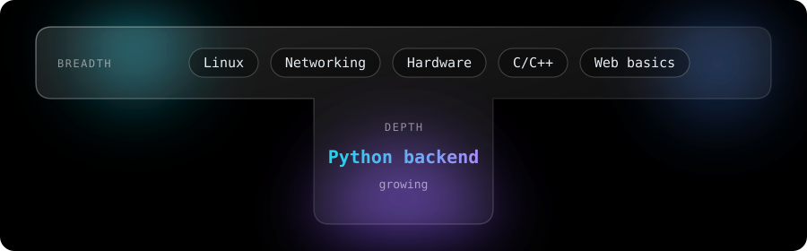
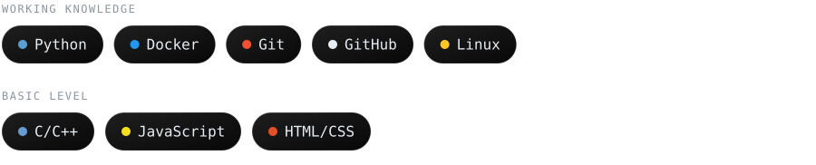

##  About

Student starting a career in **backend development (Python)** and building a **T-shaped** skill set: one deep core plus practical breadth around it.
- Into computers since age 7, learning programming for about 5 years
- Student at the Higher College of Informatics, Novosibirsk State University
- Outside of code: soldering, microcontrollers, network setup, PC building
- Current goal: consolidate fundamentals and keep growing steadily

##  Projects

| Project | What it is | My part |
|---|---|---|
| **[NodeAccess](https://app.nodeaccess.cc)** | Small VPN service | [infrastructure / bots / billing] |
| **[rezeis](https://github.com/dizzzable/rezeis)** | Open-source project | Contributor |
| **[reiwa](https://github.com/dizzzable/reiwa)** | Open-source project | Contributor |

##  Tech

##  Contact

